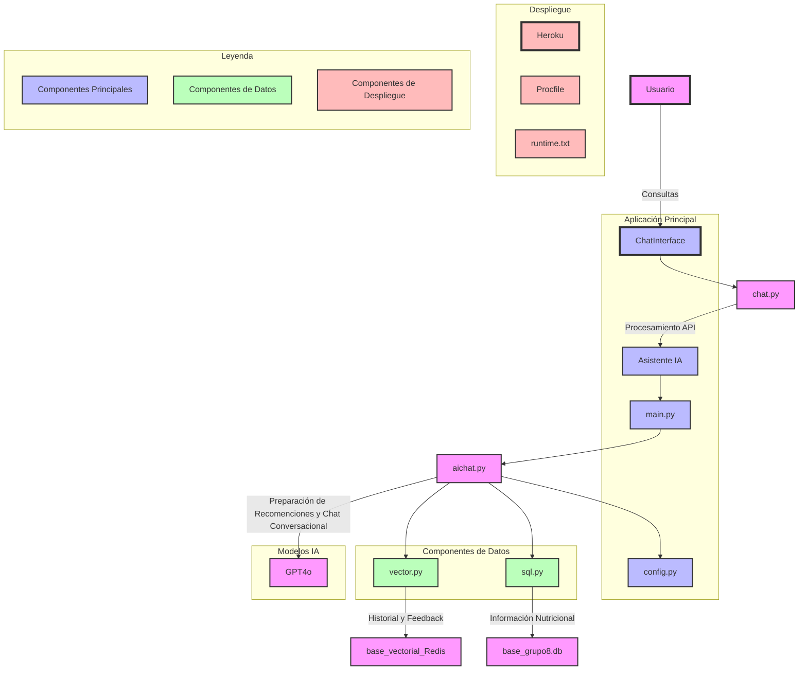

```mermaid
graph TD
    %% Nodes
    User[Usuario] -->|Consultas| ChatInterface
    ChatInterface --> ChatLogic[chat.py]
    ChatLogic[chat.py] -->|Procesamiento API| AIAssistant[Asistente IA]
    AIAssistant[Asistente IA] --> EntryPoint[main.py]
    EntryPoint[main.py] --> AILogic[aichat.py]
    AILogic[aichat.py] --> AppConfig[config.py]
    AILogic[aichat.py] --> VectorProcessor[vector.py]
    AILogic[aichat.py] --> SQLModule[sql.py]
    AILogic[aichat.py] -->|Preparación de Recomenciones y Chat Conversacional| OpenAI[GPT4o]

    %% Subgraphs
    subgraph Aplicación Principal
        ChatInterface
        AIAssistant
        EntryPoint[main.py]
        AppConfig[config.py]
    end

    subgraph Componentes de Datos
        SQLModule[sql.py]
        VectorProcessor[vector.py]
    end

    subgraph Modelos IA
        OpenAI[GPT4o]
    end

    %% Database Details
    SQLModule[sql.py] -->|Información Nutricional| Config[base_grupo8.db]
    VectorProcessor[vector.py] -->|Historial y Feedback| Confíg[base_vectorial_Redis]


    %% Deployment
    subgraph Despliegue
        Heroku[Heroku]
        Procfile[Procfile]
        Runtime[runtime.txt]
    end

    %% Styling
    classDef default fill:#f9f,stroke:#333,stroke-width:2px
    classDef primary fill:#bbf,stroke:#333,stroke-width:2px
    classDef data fill:#bfb,stroke:#333,stroke-width:2px
    classDef deployment fill:#fbb,stroke:#333,stroke-width:2px

    class User,ChatInterface,AIAssistant,EntryPoint,AppConfig primary
    class SQLModule,VectorProcessor data
    class Heroku,Procfile,Runtime deployment

    %% Legend
    subgraph Leyenda
        direction TB
        Primary[Componentes Principales]
        Data[Componentes de Datos]
        Deployment[Componentes de Despliegue]
    end

    class Primary primary
    class Data data
    class Deployment deployment

    %% Connections
    style User fill:#f9f,stroke:#333,stroke-width:4px
    style ChatInterface fill:#bbf,stroke:#333,stroke-width:4px
    style Heroku fill:#fbb,stroke:#333,stroke-width:4px
```
